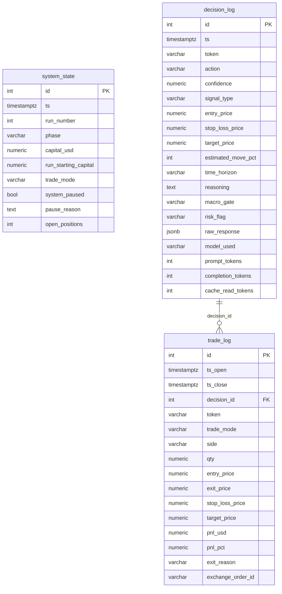
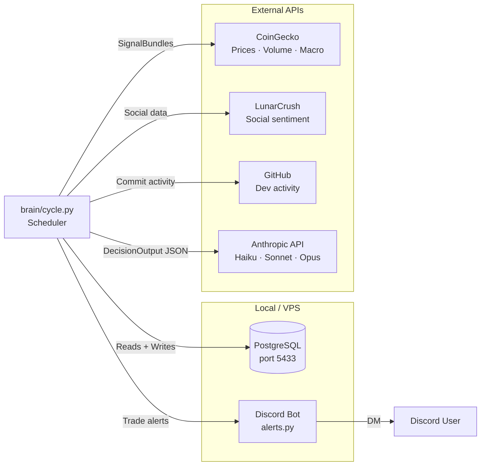

# WINS System Architecture

## Decision Cycle Flow

```mermaid
flowchart TD
    SCHED([Scheduler\nEvery 15 min]) --> CYCLE

    subgraph CYCLE["run_cycle()  —  brain/cycle.py"]
        direction TB
        A[1. Load system_state from DB\nCapital · open_positions · paused?] --> PAUSE{Paused?}
        PAUSE -- yes --> SKIP([Skip cycle])
        PAUSE -- no --> B

        B[2. Ingest signals\ncollector.py] --> C
        C[3. Check open paper positions\npaper_portfolio.py\nSL hit? TP hit? → close + return capital]

        C --> D

        subgraph TOKEN_LOOP["For each token in TARGET_TOKENS"]
            D[4. Build SignalBundle\nPrice · Volume · 24h Δ · BTC macro\nNews · Social · GitHub] --> E

            subgraph BRAIN["brain/decision.py"]
                E{USE_MOCK_BRAIN?}
                E -- true --> MOCK[mock_decision.py\nRule-based · No API cost]
                E -- false --> H[Haiku pre-filter\nCompress long text > 2000 chars]
                H --> S[Sonnet call\nSystem prompt cached\nReturns DecisionOutput JSON]
                S --> OPU{confidence ≥ 0.92\nAND catalyst signal?}
                OPU -- yes --> O[Opus escalation]
                OPU -- no --> DONE_BRAIN
                O --> DONE_BRAIN[DecisionOutput\naction · confidence · entry · SL · TP\nrisk_flag · macro_gate · reasoning]
                MOCK --> DONE_BRAIN
            end

            DONE_BRAIN --> LOG1[5. Write to decision_log\nAll decisions logged\nincl. token usage + cache_read_tokens]
            LOG1 --> RISK

            subgraph RISK["execution/risk.py  —  8 hard rules, no Claude override"]
                RISK[6. validate_decision]
                RISK --> R1{Hold?} -- yes --> APPROVE
                R1 -- no --> R2{Macro gate\nblocked?} -- yes --> REJECT
                R2 -- no --> R3{Confidence\n≥ 0.65?} -- no --> REJECT
                R3 -- yes --> R4{Open positions\n< 2?} -- no --> REJECT
                R4 -- yes --> R5{SL ≤ 20%\nSL > 0?} -- no --> REJECT
                R5 -- yes --> R6{R:R ≥ 2:1?} -- no --> REJECT
                R6 -- yes --> R7{Drawdown\n< 40%?} -- no --> KILL
                R7 -- yes --> R8{risk_flag\n≠ high?} -- no --> REJECT
                R8 -- yes --> APPROVE
            end

            APPROVE --> EXEC
            REJECT --> NEXT[Next token]
            KILL[Pause system\nAlert Discord] --> NEXT

            subgraph EXEC["execution/executor.py"]
                direction TB
                EXEC{TRADE_MODE?}
                EXEC -- paper --> PAP[PaperExecutor\nSimulate fill\nRecord qty · fill_price]
                EXEC -- live --> LIVE[LiveExecutor\nMarket buy via exchange\nPlace native SL order]
            end

            PAP --> LOG2[7. Write to trade_log\nUpdate system_state\nAlert Discord]
            LIVE --> LOG2
            LOG2 --> NEXT
        end

        NEXT --> FINAL[8. Final system_state persist\nCapital · open_positions]
        FINAL --> HEALTH[Alert: system health summary]
    end
```

---

## Data Stores



---

## Service Layout



---

## Risk Rules (Hard-coded, Claude cannot override)

| # | Rule | Threshold |
|---|------|-----------|
| 1 | Hold short-circuits | Always approved |
| 2 | Macro gate | BTC risk-off → block all entries |
| 3 | Min confidence | ≥ 0.65 |
| 4 | Max open positions | ≤ 2 |
| 5a | Max stop-loss distance | ≤ 20% from entry |
| 5b | Min R:R | ≥ 2:1 reward-to-risk |
| 6 | Drawdown kill switch | < 40% from run start capital |
| 7 | Risk flag | `risk_flag=high` → block |

---

## Token Universe

**Active (first live test):** `SOL · SUI · JUP · ARB · LINK`

**Macro gate only (never traded):** `BTC · ETH`

**Expand to full list after caching verified:**
`SOL AVAX DOT LINK ARB OP INJ SUI APT NEAR FTM ATOM ALGO AAVE UNI SNX CRV LDO DYDX GMX PENDLE JUP PYTH WIF BONK`

---

## Pre-API-Key Checklist

- [x] Model IDs correct (Haiku / Sonnet / Opus)
- [x] Drawdown kill switch uses run start capital
- [x] R:R ≥ 2:1 enforced in risk layer
- [x] Stub text stripped from signal bundles
- [x] Token usage wired into decision_log
- [x] Opus escalation tightened (≥ 0.92 + catalyst only)
- [x] Per-trade state persistence (crash-safe)
- [x] TARGET_TOKENS trimmed to 5 for first live test
- [x] GITHUB_TOKEN set (5000 req/hr authenticated)
- [x] test_risk.py — 16 passing (all 8 hard rules)
- [x] test_cycle_mock.py — 4 passing (interface + pipeline smoke tests)
- [x] Mock cycle verified against local Docker DB
- [ ] ANTHROPIC_API_KEY set in Doppler
- [ ] Run ONE real cycle — inspect decision_log for cache_read_tokens > 0 on call #2
- [ ] Expand TARGET_TOKENS back to full list
